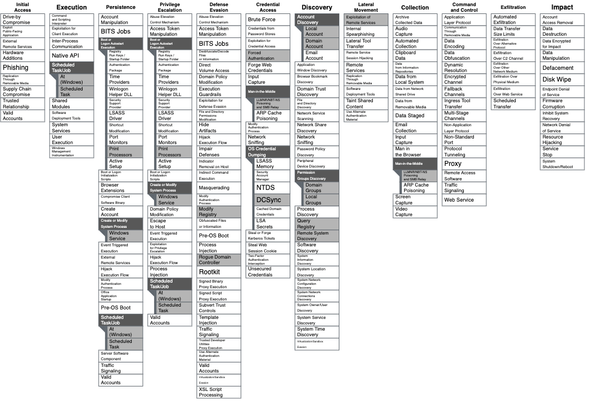

# MSRPC-To-ATT&CK
A repository that maps commonly used MSRPC protocols to Mitre ATT&CK while providing context around potential indicators of activity, prevention opportunities, and related RPC information. 

## List of MSRPC Protcols: 
* [MS-SCMR: Service Control Manager Remote Protocol](https://docs.microsoft.com/en-us/openspecs/windows_protocols/ms-scmr/d5bd5712-fa64-44bf-9433-3651f6a5ce97)
  * [MS-SCMR.md](./documents/MS-SCMR.md)
* [MS-DRSR: Directory Replication Service Remote Protocol](https://docs.microsoft.com/en-us/openspecs/windows_protocols/ms-drsr/06205d97-30da-4fdc-a276-3fd831b272e0)
  * [MS-DRSR.md](./documents/MS-DRSR.md)
* [MS-RRP: Windows Remote Registry Remote Protocol](https://docs.microsoft.com/en-us/openspecs/windows_protocols/ms-rrp/0fa3191d-bb79-490a-81bd-54c2601b7a78)
  * [MS-RRP.md](./documents/MS-RRP.md)
* [MS-TSCH: Task Scheduler Service Remoting Protocol](https://docs.microsoft.com/en-us/openspecs/windows_protocols/ms-tsch/d1058a28-7e02-4948-8b8d-4a347fa64931)
  * [MS-TSCH.md](./documents/MS-TSCH.md)
* [MS-WKST: Workstation Service Remote Protocol](https://docs.microsoft.com/en-us/openspecs/windows_protocols/ms-wkst/5bb08058-bc36-4d3c-abeb-b132228281b7)
  * [MS-WKST.md](./documents/MS-WKST.md)
* [MS-SRVS: Server Service Remote Protocol](https://docs.microsoft.com/en-us/openspecs/windows_protocols/ms-srvs/accf23b0-0f57-441c-9185-43041f1b0ee9)
  * [MS-SRVS.md](./documents/MS-SRVS.md)
* [MS-RPRN: Print System Remote Protocol](https://docs.microsoft.com/en-us/openspecs/windows_protocols/ms-rprn/d42db7d5-f141-4466-8f47-0a4be14e2fc1)
  * [MS-RPRN.md](./documents/MS-RPRN-PAR.md)
* [MS-PAR: Print System Asynchronous Remote Protocol](https://docs.microsoft.com/en-us/openspecs/windows_protocols/ms-par/695e3f9a-f83f-479a-82d9-ba260497c2d0)
  * [MS-PAR.md](./documents/MS-RPRN-PAR.md)
* [MS-SAMR: Security Account Manager Remote Protocol](https://docs.microsoft.com/en-us/openspecs/windows_protocols/ms-par/695e3f9a-f83f-479a-82d9-ba260497c2d0)
  * [MS-SAMR.md](./documents/MS-SAMR.md)
* [MS-LSAD: Local Security Authority (Domain Policy) Remote Protocol](https://docs.microsoft.com/en-us/openspecs/windows_protocols/ms-lsad/1b5471ef-4c33-4a91-b079-dfcbb82f05cc)
  * [MS-LSAD.md](./documents/MS-LSAD-LSAT.md)
* [MS-LSAT: Local Security Authority (Translation Methods) Remote Protocol](https://docs.microsoft.com/en-us/openspecs/windows_protocols/ms-lsat/1ba21e6f-d8a9-462c-9153-4375f2020894)
  * [MS-LSAT.md](./documents/MS-LSAD-LSAT.md)
* [MS-EFSR: Encrypting File System Remote (EFSRPC) Protocol](https://docs.microsoft.com/en-us/openspecs/windows_protocols/ms-efsr/08796ba8-01c8-4872-9221-1000ec2eff31)
  * [MS-EFSR.md](./documents/MS-EFSR.md)
* [MS-NRPC: Netlogon Remote Protocol](https://docs.microsoft.com/en-us/openspecs/windows_protocols/ms-nrpc/19896c1c-7e64-419b-a759-a9dc5662a780)
  * [MS-NRPC.md](./documents/MS-NRPC.md)
* [MS-FSRVP: File Server Remote VSS Protocol](https://docs.microsoft.com/en-us/openspecs/windows_protocols/ms-fsrvp/67f0fdd9-d8bc-445d-95de-2cb6d5c4d149)
  * [MS-FSRVP.md](./documents/MS-FSRVP.md)
* [MS-DFSNM: Distributed File System (DFS): Namespace Management Protocol](https://docs.microsoft.com/en-us/openspecs/windows_protocols/ms-dfsnm/a7ecdbe0-c138-471d-85b6-a474825da9eb)
  * [MS-DFSNM.md](./documents/MS-DFSNM.md)
## MITRE ATT&CK Navigator: 

* [Mitre Navigator Link](https://mitre-attack.github.io/attack-navigator/#layerURL=https%3A%2F%2Fgist.githubusercontent.com%2Fjsecurity101%2Ffd45241a8a809ec02e335e02f4220fa7%2Fraw%2Fef6751e70c6d0e7e15ed7cc7cc2dfa082fe82270%2Frpc-mapping.json)

## Contents: 
Each document will hold information about the following: 
* Protocol Name
* Interface UUID
* Server Binary (where the server code is stored, if it is loaded into another binary then the binary name image that loaded the server code.)
* Endpoint (transport protocol - [ncacn_np](https://docs.microsoft.com/en-us/openspecs/windows_protocols/ms-rpce/7063c7bd-b48b-42e7-9154-3c2ec4113c0d) and/or [ncacn_ip_tcp](https://docs.microsoft.com/en-us/openspecs/windows_protocols/ms-rpce/95fbfb56-d67a-47df-900c-e263d6031f22))
* ATT&CK Relation
* Indicator of Activity (IOA)
* Prevention Opportunities
  * Default RPC Filters will show that the `remote_user_token` that is allowed to communicate over the interface are Domain Admins (DA). This isn't the best route to go however; create a group specific to the action you want to take and apply that SID to the DACL within the SDDL string. This comes from a conversation that was had with [Andrew Robbins](https://twitter.com/_wald0). He suggests restricting domain admins interactive logons on DCs.
  * Great resource for understanding RPC Filters: https://www.tiraniddo.dev/2021/08/how-windows-firewall-rpc-filter-works.html
  * Filters were tested in a lab, not in a production environment. They may require tuning. Proceed with caution. 
* Notes
* Useful Resources

### Recognition: 

Thank you to the following for giving feedback: 
* James Forshaw
* Olaf Hartong
* Red Canary's Detection Enablement Team

